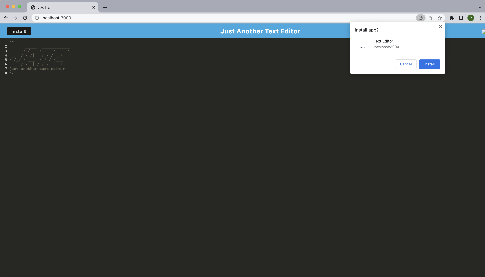
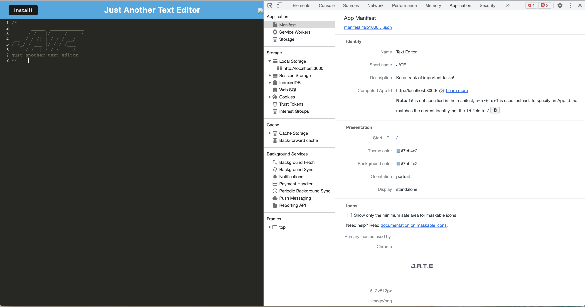
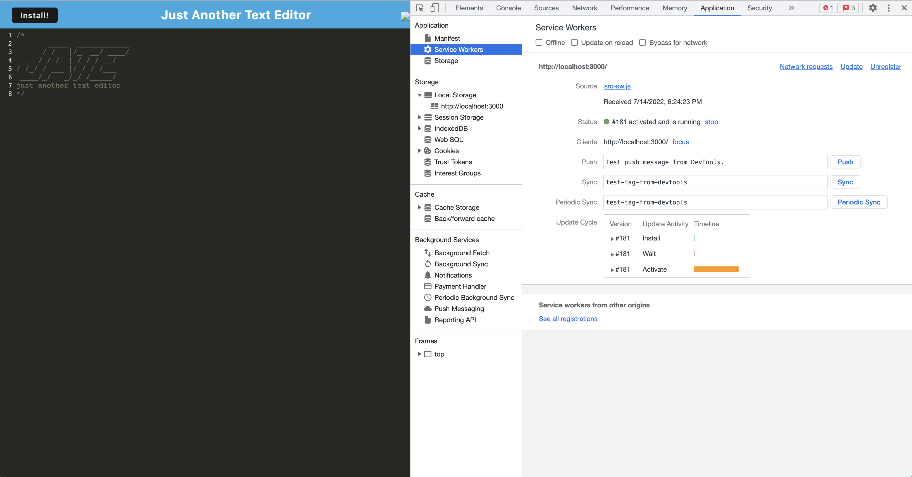
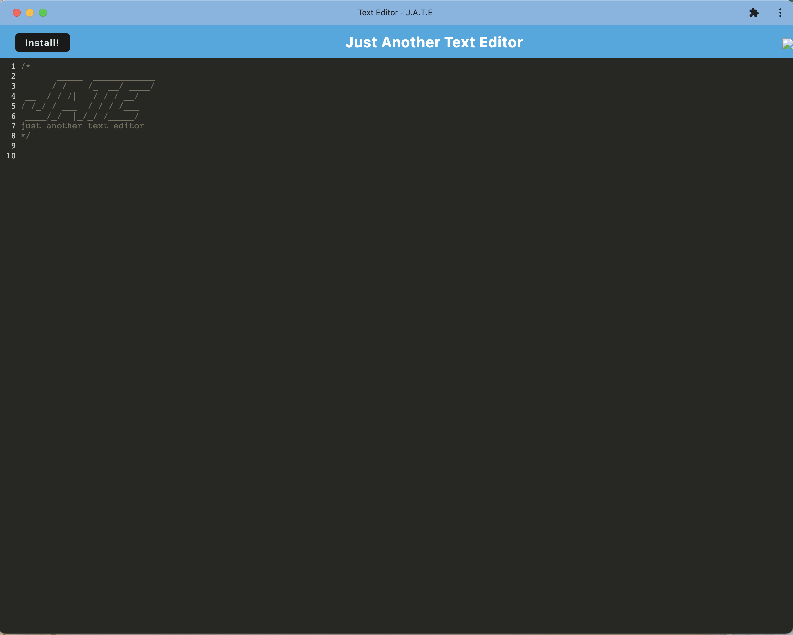

# 19 Progressive Web Applications (PWA): Text Editor
----------------------------
#### Description
This application features a Text Editor Progressive Web Application (PWA) which allows users to download locally to their device and have access to the application off-line as well.

----------------------------
#### Table of Contents
- [Description](#description)
- [Installation](#installation)
- [Process](#process)
- [License](#license)
- [Contributors](#contributors)
- [Contact](#contact)

----------------------------
#### Installation
- This application requires **Node.JS**
- Install necessary npm packages:
```md
    npm run install
```
- Starting the application:
```md
    npm run start:dev
```
----------------------------
#### Process
- Application installation process:

- Displays application's **manifest.json** file:

- Displays application's **registered service worker**:

- Application:


----------------------------
#### License


----------------------------
#### Contributors
* Paul Won
    * github: https://github.com/paulwon2223
    * email: wonpaul2223@gmail.com

----------------------------
#### Contact
- Project Github Repo: https://github.com/paulwon2223/PWA-Text-Editor-PW
- Heroku Link: 